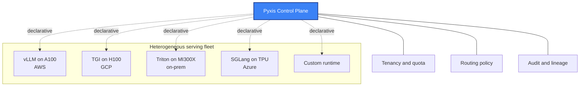

# Pyxis architecture and design

Public notes on the architecture of [Pyxis](https://pyxis3.ai), a model-agnostic LLM serving infrastructure. This is the **why** repo, covering design decisions, the model-agnosticity argument, and the operating model.

## The thesis

Enterprises running language models in production today face a triple lock-in problem:

1. **Cloud lock-in**: the inference fleet lives on one cloud's GPUs (AWS, GCP, Azure). Moving a model means re-implementing the serving stack.
2. **Vendor lock-in**: the control plane is bound to one MLOps vendor (Seldon, ClearML, ZenML, Domino). Moving means losing audit, lineage, and fair-share scheduling.
3. **Runtime lock-in**: the model is wired to one inference runtime (vLLM, TGI, TensorRT-LLM, SGLang). Moving means re-tuning latency and throughput from scratch.

Each lock-in is independent. Each has a different cost to break. None of the existing platforms solve all three.

**Pyxis is the operations layer that lets you mix and match.** The same control plane drives the same models on the same KPIs across heterogeneous fleets: cloud, on-prem, or mixed.

## Operating model

```
                         ┌────────────────────┐
                         │  Pyxis Control     │
                         │  - Tenancy/quota   │
                         │  - Routing policy  │
                         │  - Audit/lineage   │
                         └─────────┬──────────┘
                                   │ declarative
            ┌──────────┬───────────┼───────────┬──────────┐
            │          │           │           │          │
       ┌────▼──┐  ┌────▼───┐  ┌────▼────┐ ┌────▼───┐ ┌────▼────┐
       │ vLLM  │  │ TGI    │  │ Triton  │ │ SGLang │ │ Custom  │
       │ on    │  │ on     │  │ on      │ │ on     │ │ runtime │
       │ A100  │  │ H100   │  │ MI300X  │ │ TPU    │ │         │
       └───────┘  └────────┘  └─────────┘ └────────┘ └─────────┘
       AWS         GCP          On-prem    Azure       Wherever
```



## Surfaces

- **Control plane**: Kubernetes-native operator and CRDs for model serving, batch inference, and evaluation jobs.
- **Tenancy**: fair-share scheduling at the GPU level, per-team quotas, and cost attribution.
- **Runtime adapters**: a uniform interface to vLLM, TGI, Triton, SGLang, TensorRT-LLM, and Ollama, with routing by model size, latency budget, and hardware availability.
- **Audit and lineage**: every inference call tagged with model version, runtime version, hardware class, and requesting tenant.
- **Observability**: Prometheus metrics and OpenTelemetry traces, pluggable into existing observability stacks.

## Design decisions

### Why Kubernetes-native

Every serious AI infrastructure in 2026 ships on Kubernetes. Building a non-K8s control plane means building cluster orchestration we would inherit for free. Operator and CRDs is the convention, and we follow it.

### Why heterogeneous-fleet-first

Most AI platforms assume homogeneous fleets: one cloud, one GPU class, one runtime. Real enterprises run mixed estates. Pyxis assumes mixed by default and treats homogeneous as a degenerate case.

### Why no managed inference

Pyxis is the control plane, not the runtime. We integrate with the runtimes that already exist. We don't compete with vLLM. The vLLM author's team is doing inference better than we ever will. Our job is to make their work fit into a tenanted, observable, audited operations envelope.

### Why model-agnostic matters

If Pyxis added a managed inference offering, every cloud and every model vendor would push back on integration. By staying neutral, Pyxis becomes the layer everyone integrates with rather than the layer everyone competes against.

## Related public work

- [`pyxis3-ai/vllm-bench`](https://github.com/pyxis3-ai/vllm-bench): throughput and latency benchmark for OpenAI-compatible runtimes (vLLM, TGI, llama.cpp, Ollama). The measurement layer Pyxis uses to compare runtime and hardware pairs.
- [`pyxis3-ai/lens`](https://github.com/pyxis3-ai/lens): lightweight Kubernetes observability for ML-serving clusters. The observability surface Pyxis ships on top of.

## Founder

**[Omar Abdrabo](https://github.com/oabdrabo)**, Senior Solutions Engineer at Seldon Technologies (vLLM and LLM inference). Previously Industry Specialist Solutions Architect at AWS UK for Semiconductors & Manufacturing (AI/ML workloads on Inferentia, Trainium, SageMaker, and Bedrock), then Dell EMC and IBM. Author of the AWS Knowledge Center reference guide on decoupling Amazon RDS from Elastic Beanstalk, with the companion video on AWS's [official YouTube channel](https://www.youtube.com/watch?v=vfIdLuhKTs8) referenced as *"Watch Omar's video to learn more"* since May 2020.

[github.com/oabdrabo](https://github.com/oabdrabo)
[pyxis3.ai](https://pyxis3.ai)
