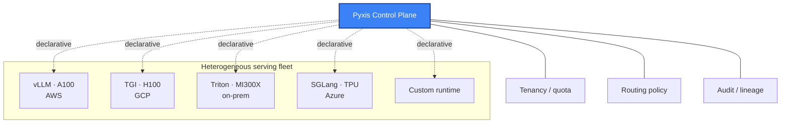

# Pyxis — architecture & design

Public notes on the architecture of [Pyxis](https://pyxis3.com), a model-agnostic LLM serving infrastructure. This is the **why** repo — design decisions, the model-agnosticity argument, and the operating model.

## The thesis

Enterprises running language models in production today face a triple lock-in problem:

1. **Cloud lock-in** — the inference fleet lives on one cloud's GPUs (AWS, GCP, Azure); moving a model means re-implementing the serving stack
2. **Vendor lock-in** — the control plane is bound to one MLOps vendor (Seldon, ClearML, ZenML, Domino); moving means losing audit, lineage, fair-share scheduling
3. **Runtime lock-in** — the model is wired to one inference runtime (vLLM, TGI, TensorRT-LLM, SGLang); moving means re-tuning latency/throughput from scratch

Each lock-in is independent. Each has a different cost to break. None of the existing platforms solve all three.

**Pyxis is the operations layer that lets you mix and match.** The same control plane drives the same models on the same KPIs across heterogeneous fleets — cloud, on-prem, mixed.

## Operating model

```
                         ┌────────────────────┐
                         │  Pyxis Control     │
                         │  - Tenancy/quota   │
                         │  - Routing policy  │
                         │  - Audit/lineage   │
                         └─────────┬──────────┘
                                   │ declarative
            ┌──────────┬───────────┼───────────┬──────────┐
            │          │           │           │          │
       ┌────▼──┐  ┌────▼───┐  ┌────▼────┐ ┌────▼───┐ ┌────▼────┐
       │ vLLM  │  │ TGI    │  │ Triton  │ │ SGLang │ │ Custom  │
       │ on    │  │ on     │  │ on      │ │ on     │ │ runtime │
       │ A100  │  │ H100   │  │ MI300X  │ │ TPU    │ │         │
       └───────┘  └────────┘  └─────────┘ └────────┘ └─────────┘
       AWS         GCP          On-prem    Azure       Wherever
```




## Surfaces

- **Control plane** — Kubernetes-native; operator + CRDs for model serving, batch inference, evaluation jobs
- **Tenancy** — fair-share scheduling at the GPU level; per-team quotas; cost attribution
- **Runtime adapters** — uniform interface to vLLM, TGI, Triton, SGLang, TensorRT-LLM, Ollama; route by model size, latency budget, hardware availability
- **Audit & lineage** — every inference call tagged with model version, runtime version, hardware class, requesting tenant
- **Observability** — Prometheus metrics, OpenTelemetry traces; pluggable into existing observability stacks

## Design decisions

### Why Kubernetes-native

Every serious AI infrastructure in 2026 ships on Kubernetes. Building a non-K8s control plane means building cluster orchestration we'd inherit for free. Operator + CRDs is the convention; we follow it.

### Why heterogeneous-fleet-first

Most "AI platforms" assume homogeneous fleets — one cloud, one GPU class, one runtime. Real enterprises run mixed estates. Pyxis assumes mixed by default and treats homogeneous as a degenerate case.

### Why no managed inference

Pyxis is the control plane, not the runtime. We integrate with the runtimes that already exist — we don't compete with vLLM. The vLLM author's team is doing inference better than we ever will; our job is to make their work fit into a tenanted, observable, audited operations envelope.

### Why model-agnostic matters

If Pyxis added a managed inference offering, every cloud + every model vendor would push back on integration. By staying neutral, Pyxis becomes the layer everyone integrates with rather than the layer everyone competes against.

## Related public work

- [`pyxis3-ai/vllm-bench`](https://github.com/pyxis3-ai/vllm-bench) — throughput & latency benchmark for OpenAI-compatible runtimes (vLLM, TGI, llama.cpp, Ollama). The measurement layer Pyxis uses to compare runtime/hardware pairs.
- [`oabdrabo/lens`](https://github.com/oabdrabo/lens) — lightweight Kubernetes observability for ML-serving clusters. The observability surface Pyxis ships on top of.

## Founder

**[Omar A.](https://github.com/oabdrabo)** — ex-Seldon Senior Solutions Engineer (vLLM, LLM inference); ex-AWS Industry Specialist for AI/ML & semiconductors (Inferentia, Trainium, SageMaker, Bedrock); ex-Dell EMC; ex-IBM. 2× AWS Knowledge Center author with companion AWS YouTube video referenced as *"[Watch Omar's video to learn more](https://www.youtube.com/watch?v=vfIdLuhKTs8)"* since May 2020.

[github.com/oabdrabo](https://github.com/oabdrabo) · [pyxis3.com](https://pyxis3.com)

---

